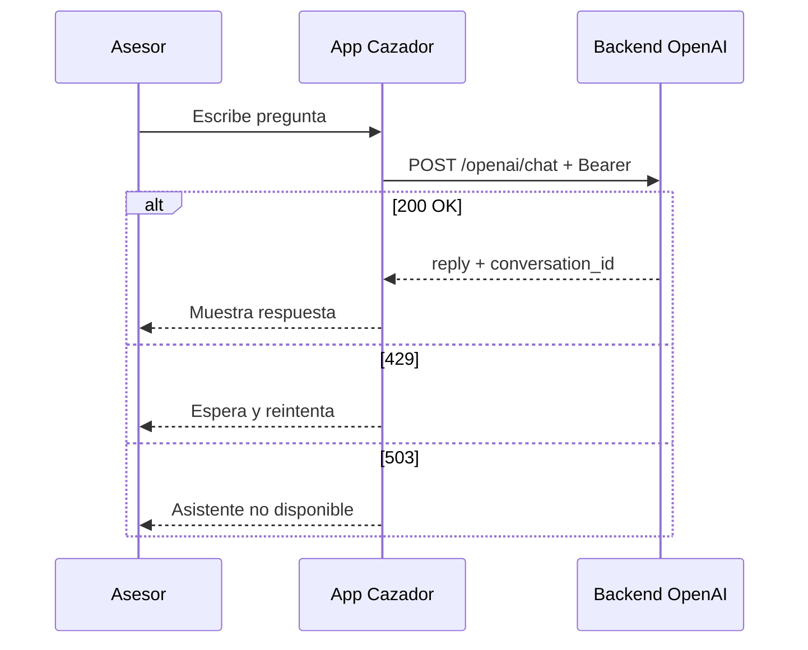

# API Cazador — Módulo OpenAI (asistente de catálogo)

Documentación para integrar el **asistente de IA** en la app móvil **Cazador** (React Native / Expo).

Contrato general del API: [API_CAZADOR.md](./API_CAZADOR.md). Prompt maestro app móvil: [PROMPT_CURSOR_REACT_NATIVE_CAZADOR.md](./PROMPT_CURSOR_REACT_NATIVE_CAZADOR.md).

---

## 1. Resumen

El módulo OpenAI permite al asesor autenticado:

1. **Consultar catálogo** vía API de conocimiento (proyectos activos, lotes disponibles, imágenes y documentos).
2. **Chatear** con un asistente que responde en español usando ese catálogo (sin datos de clientes).

| Aspecto | Valor |
|---------|--------|
| Prefijo | `/api/v1/cazador/openai` |
| Autenticación | Igual que el resto de Cazador: `Authorization: Bearer {token}` |
| OpenAI en el móvil | **No** — el backend llama a OpenAI; la app solo consume este API |
| Alcance v1 | Proyectos **activos** y lotes **LIBRE** del catálogo |

---

## 2. URL base

```
{{EXPO_PUBLIC_API_BASE_URL}}/api/v1/cazador/openai
```

Ejemplo local (Herd):

```
https://crm-lotes.test/api/v1/cazador/openai
```

Cabeceras en todas las peticiones:

```
Accept: application/json
Authorization: Bearer {token_del_login}
Content-Type: application/json   (solo en POST /chat)
```

---

## 3. Disponibilidad del módulo

Si el administrador desactiva el módulo (`OPENAI_CAZADOR_ENABLED=false` en el servidor), **todas** las rutas bajo `/openai` responden:

**HTTP 503**

```json
{
  "message": "El asistente de catálogo no está disponible en este momento."
}
```

**Recomendación en la app:** ocultar o deshabilitar la pantalla de chat si recibes 503 al cargar; mostrar mensaje amigable.

---

## 4. Rate limiting

| Grupo | Rutas | Límite por defecto | HTTP al exceder |
|-------|--------|-------------------|-----------------|
| Chat | `POST /openai/chat` | 8 req/min por asesor | **429** |
| Knowledge | `GET /openai/knowledge/*` | 60 req/min por asesor | **429** |

Tratar **429** con mensaje al usuario (esperar un momento) y backoff; no reintentar en bucle.

---

## 5. API de conocimiento (prefetch)

Base: `GET .../openai/knowledge/...`

Expone solo **catálogo público**: proyectos `is_active = true`, lotes con filtro `available_only=true` por defecto (estado `LIBRE`). **No** incluye `client`, `advisor`, comisiones ni pre-reservas.

### 5.1 Diferencia con `/projects` y `/lots`

| | `GET /projects`, `/lots` | `GET /openai/knowledge/*` |
|--|--------------------------|---------------------------|
| Uso | UI catálogo general | Contexto IA / prefetch asistente |
| Lotes | `/lots` puede incluir `client` en detalle | Sin PII |
| Assets | Rutas estándar | `download_url` absoluta en detalle proyecto |

Puedes seguir usando `/projects` para la UI y `/openai/knowledge` solo si necesitas el payload optimizado para IA.

---

### 5.2 GET `/openai/knowledge/projects`

Lista proyectos activos.

**Response 200:**

```json
{
  "data": [
    {
      "id": 1,
      "name": "Villa Norte - Mito",
      "location": "Mito",
      "total_lots": 45,
      "lots_count": 60,
      "images_count": 3,
      "documents_count": 2
    }
  ]
}
```

---

### 5.3 GET `/openai/knowledge/projects/{project}`

Detalle de un proyecto activo. Proyecto inactivo → **404**.

**Response 200:**

```json
{
  "data": {
    "id": 1,
    "name": "Villa Norte - Mito",
    "location": "Mito",
    "total_lots": 45,
    "lots_count": 60,
    "images_count": 3,
    "documents_count": 2,
    "blocks": ["A", "B", "C"],
    "assets": [
      {
        "id": 9,
        "kind": "image",
        "title": "Fachada",
        "file_name": "image_1_0847.jpg",
        "mime_type": "image/jpeg",
        "file_size": 204800,
        "download_url": "https://crm-lotes.test/api/v1/cazador/projects/1/assets/9/download"
      }
    ],
    "images": [],
    "documents": []
  }
}
```

**Nota:** `download_url` requiere Bearer (ruta protegida). Para compartir con clientes por WhatsApp usar `POST /projects/{id}/assets/share-links` — ver [API_CAZADOR.md](./API_CAZADOR.md) (sección enlaces compartibles).

---

### 5.4 GET `/openai/knowledge/lots`

Lotes del catálogo.

**Query params:**

| Param | Tipo | Default | Descripción |
|-------|------|---------|-------------|
| `project_id` | int | — | Filtra por proyecto |
| `search` | string | — | Coincidencia en manzana o número |
| `available_only` | bool | `true` | Si `true`, solo estado `LIBRE` |

**Response 200:**

```json
{
  "data": [
    {
      "id": 10,
      "block": "A",
      "number": "5",
      "area": "105.00",
      "price": "30000.00",
      "project": {
        "id": 1,
        "name": "Villa Norte - Mito",
        "location": "Mito"
      },
      "status": {
        "id": 1,
        "name": "Libre",
        "code": "LIBRE"
      },
      "can_pre_reserve": true
    }
  ]
}
```

---

### 5.5 GET `/openai/knowledge/lots/{lot}`

Detalle de un lote del catálogo (proyecto activo; por defecto solo `LIBRE`). Sin `client` ni `advisor`. Lote no disponible o inexistente → **404**.

---

## 6. Chat con el asistente

### POST `/openai/chat`

Envía un mensaje al asistente de catálogo. El backend consulta proyectos y lotes mediante tools internas y devuelve texto en español.

**Request:**

```json
{
  "message": "¿Qué proyectos hay en Huancayo y cuántos lotes libres tiene cada uno?",
  "conversation_id": "550e8400-e29b-41d4-a716-446655440000"
}
```

| Campo | Tipo | Obligatorio | Reglas |
|-------|------|-------------|--------|
| `message` | string | Sí | Máx. 2000 caracteres (configurable en servidor) |
| `conversation_id` | UUID | No | Si se omite, el servidor genera uno y lo devuelve |

**Response 200:**

```json
{
  "reply": "En Huancayo está el proyecto Mirador 3.1 con lotes disponibles en manzanas A y B. ¿Quieres que detalle precios?",
  "conversation_id": "550e8400-e29b-41d4-a716-446655440000"
}
```

**v1:** `conversation_id` se devuelve para correlación en la UI; el servidor **no** persiste historial multi-turno aún. Cada mensaje se procesa de forma independiente. En v2 podrá persistirse conversación en backend.

---

### 6.1 Qué puede y qué no puede responder el asistente

| Puede | No puede |
|-------|----------|
| Proyectos activos (ubicación, manzanas, assets) | Datos de clientes (nombre, DNI, teléfono) |
| Lotes disponibles (`LIBRE`), precio, manzana/número | Lotes del asesor (`/my-lots`) |
| Conteos de imágenes/documentos | Comisiones, tickets, pre-reservas |
| Orientación comercial general del catálogo | Prometer condiciones legales o inventar datos |

Si el dato no está en catálogo, el asistente debe indicarlo; no inventar precios ni ubicaciones.

---

### 6.2 Errores del chat

| HTTP | Cuándo | Acción en la app |
|------|--------|------------------|
| **401** | Sin token o token inválido | Logout y login |
| **422** | `message` vacío o demasiado largo | Mostrar errores de validación |
| **429** | Rate limit chat (8/min) | Mensaje “Demasiadas consultas, espera un momento” |
| **503** | Módulo deshabilitado | Ocultar/deshabilitar feature IA |

**422 ejemplo:**

```json
{
  "message": "El mensaje no puede superar 2000 caracteres.",
  "errors": {
    "message": ["El mensaje no puede superar 2000 caracteres."]
  }
}
```

---

## 7. Integración en React Native (guía)

### 7.1 Estructura sugerida

```
src/
  api/
    endpoints/
      openai.ts          # chat + knowledge
  features/
    ai-assistant/
      ChatScreen.tsx
      useOpenAiChat.ts
  types/
    openai.ts
```

### 7.2 Tipos TypeScript

```typescript
export type OpenAiChatRequest = {
  message: string;
  conversation_id?: string;
};

export type OpenAiChatResponse = {
  reply: string;
  conversation_id: string;
};

export type KnowledgeProjectSummary = {
  id: number;
  name: string;
  location: string | null;
  total_lots: number;
  lots_count: number;
  images_count: number | null;
  documents_count: number | null;
};

export type KnowledgeLot = {
  id: number;
  block: string;
  number: string;
  area: string;
  price: string;
  project: { id: number; name: string; location: string | null } | null;
  status: { id: number; name: string; code: string } | null;
  can_pre_reserve: boolean;
};
```

### 7.3 Cliente HTTP (ejemplo)

```typescript
const OPENAI_PREFIX = '/api/v1/cazador/openai';

export async function sendOpenAiChat(
  api: ApiClient,
  body: OpenAiChatRequest,
): Promise<OpenAiChatResponse> {
  const { data } = await api.post<OpenAiChatResponse>(`${OPENAI_PREFIX}/chat`, body);
  return data;
}

export async function fetchKnowledgeProjects(api: ApiClient) {
  const { data } = await api.get<{ data: KnowledgeProjectSummary[] }>(
    `${OPENAI_PREFIX}/knowledge/projects`,
  );
  return data.data;
}
```

### 7.4 Flujo de pantalla de chat



1. Mantener en estado local lista de mensajes `{ role: 'user' | 'assistant', text }`.
2. Al enviar, append mensaje usuario → `POST /chat` con último `conversation_id` (opcional).
3. Append `reply` como mensaje asistente; guardar `conversation_id` devuelto.
4. Mostrar indicador de carga durante la petición (puede tardar varios segundos).
5. No enviar datos de clientes en el mensaje (privacidad y alineación con backend).

### 7.5 Knowledge API (opcional)

- Prefetch al abrir el chat: `GET knowledge/projects` para chips de proyectos.
- Búsqueda de lotes: `GET knowledge/lots?project_id=1&search=A` para validar respuestas del asistente en UI avanzada.
- No es obligatorio si solo usas chat; el agente consulta el catálogo en servidor.

---

## 8. Ejemplos curl

### Login (obtener token)

```bash
curl -s -X POST "https://crm-lotes.test/api/v1/cazador/auth/login" \
  -H "Accept: application/json" \
  -H "Content-Type: application/json" \
  -d '{"username":"asesor1","pin":"123456"}'
```

### Chat

```bash
curl -s -X POST "https://crm-lotes.test/api/v1/cazador/openai/chat" \
  -H "Accept: application/json" \
  -H "Content-Type: application/json" \
  -H "Authorization: Bearer TU_TOKEN" \
  -d '{"message":"¿Qué proyectos activos hay?"}'
```

### Knowledge — proyectos

```bash
curl -s "https://crm-lotes.test/api/v1/cazador/openai/knowledge/projects" \
  -H "Accept: application/json" \
  -H "Authorization: Bearer TU_TOKEN"
```

### Knowledge — lotes libres de un proyecto

```bash
curl -s "https://crm-lotes.test/api/v1/cazador/openai/knowledge/lots?project_id=1&available_only=true" \
  -H "Accept: application/json" \
  -H "Authorization: Bearer TU_TOKEN"
```

---

## 9. Checklist de implementación (app móvil)

- [ ] Pantalla o entrada “Asistente de catálogo” tras login.
- [ ] `POST /openai/chat` con Bearer y manejo de 401/422/429/503.
- [ ] UI de chat (lista de mensajes + input; máx. 2000 caracteres).
- [ ] Persistir `conversation_id` en sesión de pantalla (UUID devuelto por API).
- [ ] No loguear token ni mensajes con PII en producción.
- [ ] (Opcional) Prefetch `GET knowledge/projects` para sugerencias rápidas.
- [ ] Deshabilitar botón enviar mientras hay petición en curso.
- [ ] Textos de error en español.

---

## 10. Configuración en servidor (referencia)

La app **no** configura OpenAI. Solo el backend:

| Variable | Default | Efecto |
|----------|---------|--------|
| `OPENAI_API_KEY` | — | Clave OpenAI (`config/ai.php`) |
| `OPENAI_CAZADOR_ENABLED` | `true` | `false` → 503 en todas las rutas `/openai` |
| `OPENAI_CAZADOR_MAX_MESSAGE_LENGTH` | `2000` | Límite de `message` |
| `OPENAI_CAZADOR_RATE_LIMIT` | `8` | Chat req/min por asesor |
| `OPENAI_CAZADOR_KNOWLEDGE_RATE_LIMIT` | `60` | Knowledge req/min |

---

## 11. Preguntas frecuentes

### ¿La app necesita API key de OpenAI?

No. Solo el token de asesor Cazador.

### ¿Puedo preguntar por un cliente concreto?

No en v1. El asistente solo usa catálogo de proyectos y lotes disponibles.

### ¿El historial de chat se guarda en el servidor?

En v1 no hay persistencia multi-turno; envía contexto en el mensaje si lo necesitas en la UI local.

### ¿Knowledge vs `/projects`?

Mismo catálogo base; Knowledge omite PII y está pensado para IA. Para listados de UI sigue siendo válido `/projects` y `/lots`.

---

## 12. Referencias en el repositorio backend

| Recurso | Ubicación |
|---------|-----------|
| Rutas | `routes/openai-cazador.php` |
| Config | `config/openai_cazador.php` |
| Agente | `app/OpenAi/Agents/CazadorCatalogAssistant.php` |
| Servicio catálogo | `app/OpenAi/Services/ProjectKnowledgeService.php` |
| Tests | `tests/Feature/OpenAi/Cazador/` |
| Reglas internas | `.ai/guidelines/openai-cazador.md` |

---

*Documento para integradores de la app Cazador. Versión alineada al módulo OpenAI v1 (catálogo + chat).*
